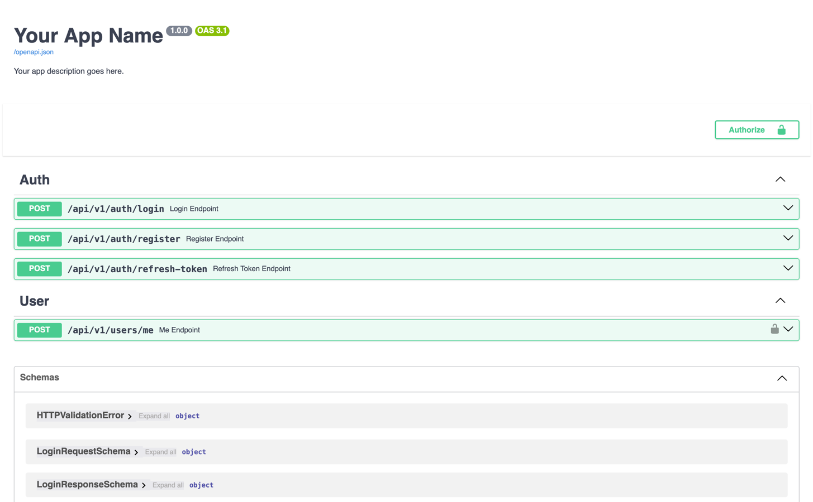
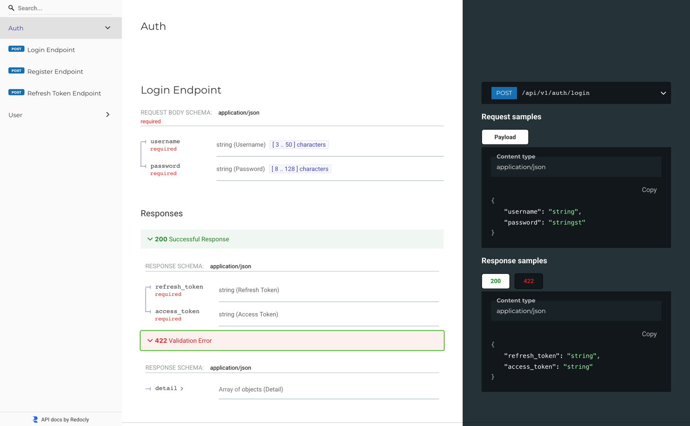

# fastapi-starter

[](/LICENSE)
[](https://github.com/azizjon-aliev/fastapi-starter/stargazers)
[](https://github.com/azizjon-aliev/fastapi-starter/network/members)
[](https://github.com/azizjon-aliev/fastapi-starter/issues)


### Swagger



### Redoc



---

A minimal — yet production-ready — FastAPI project template to kickstart your next API. Clean, async-first, and ready for real-world deployment.

---

## ✨ Overview

This starter kit provides a lightweight, well-structured FastAPI template with common features you actually need in production: auth (login/register/refresh-token/me), rate limiting (middleware + decorator), CORS, structured logging with **loguru**, repository & service layers, dependency injection (FastAPI), Pydantic settings, JWT security, PostgreSQL (SQLAlchemy + Alembic), and fully asynchronous I/O.

> Note: current repository state — there are **no tests yet**, the project uses **ruff** for linting, and **pre-commit** hooks are not configured yet. The project layout differs slightly from some templates; see the actual `tree` in the repo for exact structure.

Built to be opinionated but flexible — plug in other databases or caching layers later.

---

## 🚀 Features

* Authentication: **register**, **login**, **refresh token**, **/me** endpoint
* Security: JWT-based auth, password hashing
* Rate limiting: middleware and decorator options
* CORS support and configurable settings
* Structured logging via **loguru**
* Repository & service pattern for clean separation of concerns
* Dependency Injection using FastAPI's `Depends`
* Config management with **Pydantic Settings** (`BaseSettings`)
* Async-first: SQLAlchemy (async), all endpoints and DB access are async
* Migrations: **Alembic** configured for async SQLAlchemy
* Database: PostgreSQL out of the box (easy to swap)
* Optional: Docker and `docker-compose` for quick local/dev environments

---

## 🧭 Quick start

### 1. Clone

```bash
git clone https://github.com/azizjon-aliev/fastapi-starter.git && cd fastapi-starter
```

### 2. Env

```bash
cp .env.example .env
# edit .env (DB, secrets, etc.)
```

### 3. With Docker

```bash
docker compose up --build
# open http://0.0.0.0:8000/docs or /redoc
```

### 4. Without Docker (dev)

```bash
# create venv (using uv tool in this repo)
uv venv; source .venv/bin/activate
uv sync           # install deps
uv run alembic upgrade head
uv run uvicorn app.main:app --reload
```

---

## 🧩 Actual project layout (as in repo)

```
.
├── LICENSE
├── README.md
├── alembic.ini
├── app
│   ├── Dockerfile
│   ├── __init__.py
│   ├── api
│   │   ├── dependencies.py
│   │   ├── middlewares.py
│   │   └── v1
│   │       ├── auth_routes.py
│   │       └── user_routes.py
│   ├── core
│   │   └── config.py
│   ├── db
│   │   ├── migrations
│   │   │   ├── env.py
│   │   │   └── versions
│   │   │       └── a3285f904186_add_user_table.py
│   │   ├── models
│   │   │   └── user_model.py
│   │   └── session.py
│   ├── factories.py
│   ├── main.py
│   ├── repositories
│   │   └── user_repository.py
│   ├── schemas
│   │   └── auth_schema.py
│   ├── services
│   │   ├── auth_service.py
│   │   └── security_service.py
│   └── utils.py
├── docker-compose.yml
├── docs
├── logs
├── pyproject.toml
└── uv.lock
```

> Tip: migrations are located under `app/db/migrations`, Alembic config sits at project root (`alembic.ini`).

---

## 📚 API docs

* Swagger UI: `/docs`
* Redoc: `/redoc`

Both are enabled by default for local and containerized environments.

### Swagger Basic Auth

Swagger UI and Redoc endpoints are protected with HTTP Basic Authentication. Configure credentials via environment variables:

```bash
SWAGGER_USERNAME=admin
SWAGGER_PASSWORD=your_secure_password
```

---

## ⚙️ Configuration & env

All runtime configuration is handled via environment variables using Pydantic `BaseSettings`. Keep secrets out of source control and use `.env` only for local/dev. In production prefer secret managers (Vault, AWS Secrets Manager, etc.).

---

## 🧪 Tests

Currently there are **no tests** shipped with the template. If you want, I can add:

* a basic `pytest` setup with unit tests for services/repositories
* lightweight integration tests that spin up the app with `TestClient` and a test DB
* GitHub Actions workflow to run tests on PRs

Say which one you want and I’ll scaffold it.

---

## 🧰 Development tools

* Linter: **ruff** (already in the project)
* **pre-commit** hooks configured (ruff lint + format, trailing whitespace, etc.)
* `uv` — local helper tool included in this repo (venv, run commands, sync deps)

To install pre-commit hooks:
```bash
uv run pre-commit install
```

---

## ♻️ How to swap components (planned)

This starter is designed to be modular. Planned generator options (coming soon):

* **Database choices**: `sqlite3` | `postgres` | `mysql` | `mongodb`
* **Cache**: `memory` | `redis` | `memcached`
* **Auth providers**: builtin JWT | OAuth (Google, GitHub)
* **Task queue**: none | `celery` | `dramatiq`

When scaffolding a new project from the template, you'll be able to choose desired stacks and get a ready-to-run codebase.

---

## ✅ Roadmap

* Interactive project generator (choose DB, cache, auth, etc.)
* Add optional Celery/RabbitMQ scaffolding
* More integration tests and CI workflows
* First-class support for multi-database templates

---

## 🤝 Contributing

Contributions welcome! If you want to help:

1. Fork the repo
2. Create a feature branch
3. Open a PR with a clear description

If you'd like, I can add `pre-commit` config, initial tests, or CI pipeline — tell me what to scaffold.

---

## ✍️ Contact

Maintained by Azizjon — PRs, issues, ideas are welcome.

---

## Contributors ✨

Thanks goes to these wonderful people ([emoji key](https://allcontributors.org/docs/en/emoji-key)):

<!-- ALL-CONTRIBUTORS-LIST:START - Do not remove or modify this section -->
<!-- prettier-ignore-start -->
<!-- markdownlint-disable -->
<table>
  <tbody>
    <tr>
      <td align="center" valign="top" width="14.28%"><a href="https://github.com/azizjon-aliev"><br /><sub><b>Azizjon Aliev</b></sub></a><br /><a href="https://github.com/azizjon-aliev/fastapi-starter/commits?author=azizjon-aliev" title="Code">💻</a> <a href="https://github.com/azizjon-aliev/fastapi-starter/commits?author=azizjon-aliev" title="Documentation">📖</a></td>
    </tr>
  </tbody>
</table>

<!-- markdownlint-restore -->
<!-- prettier-ignore-end -->

<!-- ALL-CONTRIBUTORS-LIST:END -->

This project follows the [all-contributors](https://github.com/all-contributors/all-contributors) specification. Contributions of any kind welcome!
